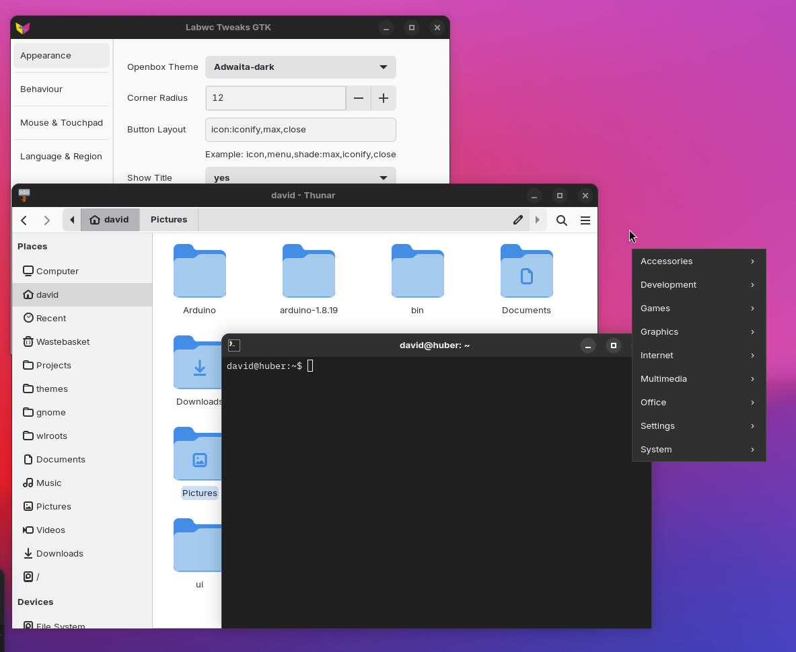
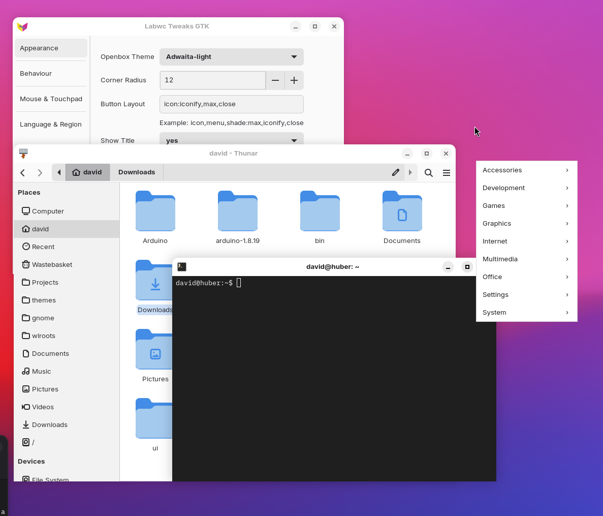

 # So what's this all about?

Here we have a (lib)Adwaita theme for labwc. 
Complete themes are in the /themes folder

Adwaita - svg buttons
Adwaita-dark - svg buttons

Labwaita - xbm buttons
Labwaita-dark - xbm buttons

The themes with xbm buttons should also be backwards compatible with openbox. 

The purpose of these themes is to *copy* as best we can - the goal is consistency not creativity, hopefully the theme will track libadwaita git stylesheets.

All buttons, iconify, menu, max, close, shade and desk are supported including their toggled and hovered states.

If you want out of the box consistency you will need to remove the maximise and minimise buttons in rc.xml

    <titleLayout>menu:close</titleLayout>

# ./elements

In this directory is a rudimentary modular theme builder, spliting bits basically into light, dark and common as well as holding the image assets. 

Its very basic. It's mostly to just help me maintain the light and dark themes and keep the padding consistant. 
It works but it's a bit rough. 
